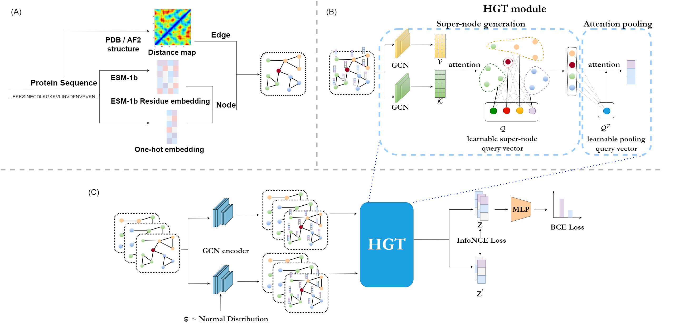

HEAL
====
Hierarchical Graph Transformer with Contrastive Learning for Protein Function Prediction
---



## Setup Environment

Clone the current repo

    git clone https://github.com/ZhonghuiGu/HEAL.git
    conda env create -f environment.yml
    conda install pytorch==1.7.0 cudatoolkit=10.2 -c pytorch
    wget https://data.pyg.org/whl/torch-1.7.0%2Bcu102/torch_cluster-1.5.9-cp37-cp37m-linux_x86_64.whl
    wget https://data.pyg.org/whl/torch-1.7.0%2Bcu102/torch_scatter-2.0.7-cp37-cp37m-linux_x86_64.whl
    wget https://data.pyg.org/whl/torch-1.7.0%2Bcu102/torch_sparse-0.6.9-cp37-cp37m-linux_x86_64.whl
    wget https://data.pyg.org/whl/torch-1.7.0%2Bcu102/torch_spline_conv-1.2.1-cp37-cp37m-linux_x86_64.whl
    pip install *.whl
    pip install torch_geometric==1.6.3

You also need to install the relative packages to run ESM-1b protein language model. \
Please see [facebookresearch/esm](https://github.com/facebookresearch/esm#getting-started-with-this-repo-) for details. \
And the ESM-1b model weight we use can be downloaded [here](https://dl.fbaipublicfiles.com/fair-esm/models/esm1b_t33_650M_UR50S.pt).


## Protein function prediction

    python predictor.py --task mf
                        --device 0 
                        --pdb case_study/4RQ2-A.pdb 
                        --esm1b_model $esm1b_model
                        --only_pdbch false
                        --prob 0.5

`$task` can be among the three GO-term task -- `[bp, mf, cc]`. \
`$pdb` is the path of the pdb file. \
`$esm1b_model` is the path of the ESM-1b model weight. \
`$prob` means outputing the functions with predicted probability larger than 0.5. \
`$only_pdbch` means using the model parameters trained on the PDBch training set solely.\
\
The default model parameters are trained on the combination of PDBch and AFch training set, e.g., `model_bpCLaf.pt`, `model_ccCLaf.pt` and `model_mfCLaf.pt`.\
You can also use the model parameters which are only trained on the PDBch training by setting `$only_pdbch` true, e.g., `model_bpCL.pt`, `model_ccCL.pt` and `model_mfCL.pt`.

#### output
```txt
The protein may hold the following functions of MF:
Possibility: 0.99 ||| Functions: GO:0034061, DNA polymerase activity
Possibility: 0.98 ||| Functions: GO:0140097, catalytic activity, acting on DNA
Possibility: 0.96 ||| Functions: GO:0003887, DNA-directed DNA polymerase activity
Possibility: 0.79 ||| Functions: GO:0003677, DNA binding
Possibility: 0.95 ||| Functions: GO:0016772, transferase activity, transferring phosphorus-containing groups
Possibility: 0.97 ||| Functions: GO:0016779, nucleotidyltransferase activity
```

## Exploring functions of understudied protein
For exploring functions of understudied protein, we recommend to consider the predicted results from both `_CLaf.pt` and `_CL.pt` parameters. \
When there are no functions predicted under the probability threshold 0.5, you can set `$prob` lower to 0.4, 0.3 or even 0.2, and the predicted results still have reference value.

## Model training

    cd data

Our data set can be downloaded from [here](https://disk.pku.edu.cn/link/AAD5055347F424437FBDDC37BCA4C7398E).

    tar -zxvf processed.tar.gz

The dataset related files will be under `data/processed`. 
Files with prefix of `AF2` belong to AFch dataset, others belong to PDBch dataset.
Files with suffix of `pdbch` record the PDBid or uniprot accession of each protein, and files with suffix of `graph` contain the graph we constructed for each protein.  

```txt
AF2test_graph.pt  AF2train_graph.pt  AF2val_graph.pt  test_graph.pt  train_graph.pt  val_graph.pt
AF2test_pdbch.pt  AF2train_pdbch.pt  AF2val_pdbch.pt  test_pdbch.pt  train_pdbch.pt  val_pdbch.pt
```

#### To train the model:

    python train.py --device 0
                    --task bp 
                    --batch_size 64 
                    --suffix CLaf
                    --contrast True
                    --AF2model True   
                    
`$task` can be among the three GO-term task -- `[bp, mf, cc]`. \
`$suffix` is the suffix of the model weight file that will be saved. \
`$contrast` is whether to use contrastive learning. \
`$AF2model` is whether to add AFch training set for training.

#### For whom want to build the new dataset: 

The `*graph.pt` file contain the list of protein graphs, the way to build the graph can be seen from `predictor.py`. \
Each graph is built by `Pytorch Geometric`, and each graph has three attributes. \
`graph.edge_index \in [2, protein_len]` is edge index of residue pairs whose Ca are within 10 angstroms.\
`graph.native_x` is the one-hot embedding for each residue type. \
`graph.x` is the ESM-1b language embedding for each sequences.

`graph_data.py` is the script to load the data. If you want to train a new model, you can change the `self.graph_list` and `self.y_true` variable.
